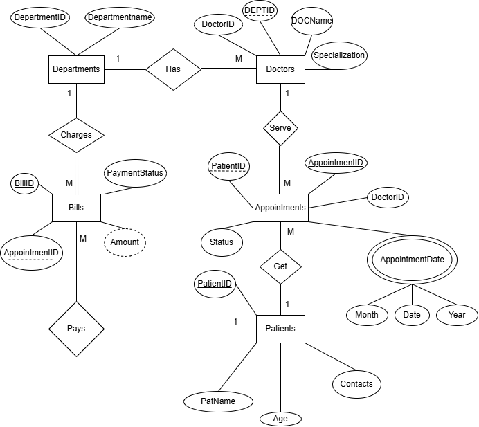

# Hospital Management System: Database Report

## 1. Project Overview
This database is designed to manage the core operations of a hospital, including department organization, doctor assignments, patient records, appointment scheduling, and billing. You can test the database from Database_code.sql in online Editors like OneCompiler.

### Project Resources
* **Source Code:** [Database_code.sql](./Database_code.sql)
* **Online Sandbox:** [Test and Run on OneCompiler](https://onecompiler.com/mysql/44fbpj3v2)

### Entity Relationship Diagram (ERD)

## 2. Database Schema & Data
Below are the core tables populated with sample data to demonstrate the system's functionality.

### **Departments Table**
| DeptID | DeptName |
| :--- | :--- |
| 1 | Cardiology |
| 2 | Neurology |
| 3 | Pediatrics |
| 4 | General Medicine |
| 5 | UROLOGY |

### **Doctors Table**
| DoctorID | DocName | DeptID | Specialization |
| :--- | :--- | :--- | :--- |
| 1 | Dr. Smith | 1 | Heart Surgeon |
| 2 | Dr. Adams | 2 | Neurologist |
| 3 | Dr. Brown | 3 | Child Specialist |
| 4 | Dr. Taylor | 4 | GP |
| 5 | Dr. Strange | 1 | Magic Arts |

### **Patients Table**
| PatientID | PatName | Contact | Age |
| :--- | :--- | :--- | :--- |
| 1 | Alice Johnson | 555-0101 | 29 |
| 2 | Bob Miller | 555-0202 | 45 |
| 3 | Charlie Davis | 555-0303 | 10 |
| 4 | Diana Prince | 555-0404 | 34 |
| 5 | Edward Norton | 555-0505 | 60 |

### **Appointments Table**
| AppointID | PatientID | DoctorID | AppointDate | Status |
| :--- | :--- | :--- | :--- | :--- |
| 1 | 1 | 1 | 2026-03-01 | Completed |
| 2 | 2 | 2 | 2026-03-02 | Completed |
| 3 | 3 | 3 | 2026-03-03 | Scheduled |
| 4 | 4 | 4 | 2026-03-04 | Scheduled |
| 5 | 5 | 1 | 2026-03-05 | Scheduled |

### **Bills Table**
| BillID | AppointID | Amount | PaymentStatus |
| :--- | :--- | :--- | :--- |
| 1 | 1 | 500.00 | Paid |
| 2 | 2 | 750.00 | Paid |
| 3 | 3 | 150.00 | Pending |
| 4 | 4 | 100.00 | Pending |
| 5 | 5 | 500.00 | Pending |

---

## 3. Database Concepts & Theory

### **1. Joins**
Joins are used to combine rows from two or more tables based on a related column.
* **Inner Join:** Returns records that have matching values in both tables. We used this to link Patients and Doctors to their specific Appointments.
* **Left Join:** Returns all records from the left table, and the matched records from the right. We used this to show all Doctors, including those like *Dr. Strange* who have no appointments yet.
* **Right Join:** Returns all records from the right table, and the matched records from the left. This helped us identify empty Departments like *Urology*.

### **2. Aggregate Functions**
These functions perform a calculation on a set of values and return a single value. 
* We used `SUM(Amount)` to calculate total revenue and `COUNT(BillID)` to track the number of transactions, grouped by `PaymentStatus`.

### **3. Subqueries**
A subquery is a query nested inside another statement. In our code, we used a multi-level subquery to find the names of patients whose bills were higher than the average hospital bill.

### **4. Database Views**
A **View** is a searchable object in a database that is defined by a query. We created the `DailySchedule` view to act as a "virtual table" so staff can quickly check appointments without writing complex join logic every time.

### **5. Transaction Management (ACID)**
Transactions ensure that a series of database operations are treated as a single unit.
* **COMMIT:** Makes all changes made in the transaction permanent.
* **ROLLBACK:** Reverts the database to its previous state if an error occurs or a condition isn't met, ensuring data integrity.

---

## 4. Query Results
### Join Results (Inner/Left/Right)
| Context | Result |
| :--- | :--- |
| **Inner Join** | Showed 5 matched appointments with Patient/Doctor names. |
| **Left Join** | Listed all doctors; *Dr. Strange* showed `NULL` for appointments. |
| **Right Join** | Listed all departments; *Urology* showed `NULL` for assigned doctors. |

### Aggregate Summary
| Payment Status | Total Revenue | Bill Count |
| :--- | :--- | :--- |
| Paid | 1250.00 | 2 |
| Pending | 750.00 | 3 |
